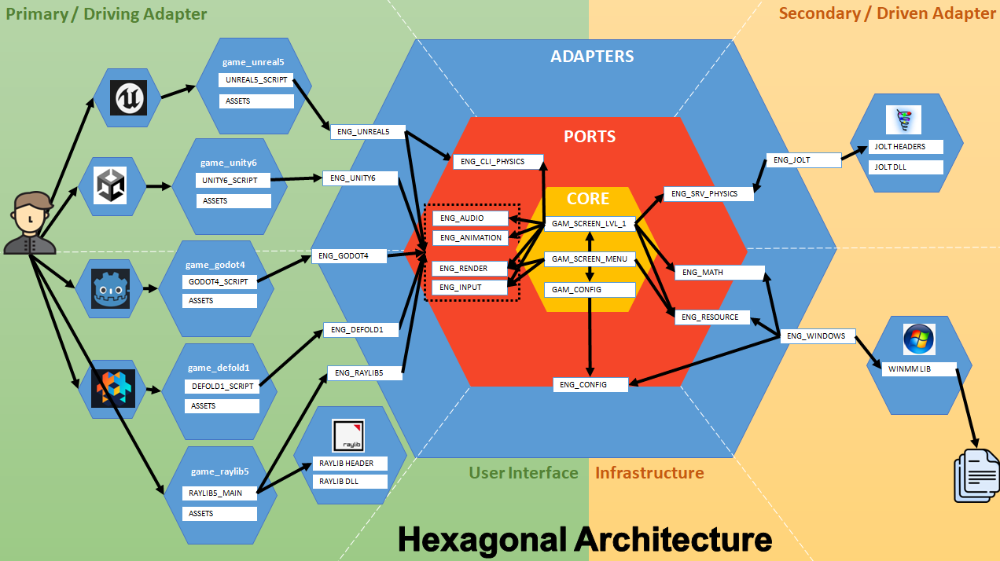

# 3D Game Starter - Multi Engine (Unreal, Unity, Godot, Defold, Raylib, The Forge)

[](https://opensource.org/licenses/MIT)
[](https://twitter.com/Damien_Fremont)
[](https://www.buymeacoffee.com/damienfremont)

:warning: **WORK IN PROGRESS !!!**

2025's exercise in game engine and logic modules.

## Content

  - [Dependencies](#dependencies)
  - [Screenshots](#screenshots)
  - [Features](#features)
  - [Install](#install)
  - [Usage](#usage)
  - [Assets](#assets)
  - [Resources](#resources)

---------------------------------------

## Dependencies

- C++ 2020 / C 2017

## Screenshots




## Features

- Engine
  - [ ] Unreal (5.4.3)
  - [ ] Unity (6.0.1)
  - [ ] Godot (4.3)
  - [ ] Defold (1.9.1)
  - [ ] Raylib (5.0)
  - [ ] TheForge (1.58)
- Features
  - [ ] 3D
    - [ ] Camera (Third Person)
    - [ ] Skybox (Cube)
    - [ ] Inputs (Gamepad)
    - [ ] Lighting (World and Character)
    - [ ] Material (Texture or Shaders)
  - [ ] Physics
    - [ ] Gravity
    - [ ] Colision
  - [ ] Audio
    - [ ] Sound effects
  - [ ] UI
    - [ ] Main Menu
    - [ ] Settings Menu
- Examples:
  - [ ] "Unreal" First Person (FPS)
  - [ ] "Unreal" Third Person (TPS)
  - [ ] "Matrix" Demo (OpenWorld)

Repository layout:
```
├── assets
├── docs
├── infra
├── lib
├── platform
│   ├── engine
│   └── game
├── standalone
│   ├── unreal_desktop_win64
│   ├── unity_desktop_win64
│   └── ...
└── tools
    └── blender
    └── ci
```

